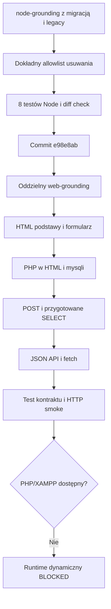

# 2026-09-06 — rozdzielenie Node i kursu HTML/PHP

## Purpose

Domknąć uproszczenie materiałów Node.js w `E:\Projekty\node-grounding` oraz utworzyć osobny kurs HTML/PHP/MySQL dla XAMPP w `E:\Projekty\web-grounding`.

## Scope and constraints

- Usunięto wyłącznie jawnie wskazane pliki `*.legacy`; aktywne pliki Node pozostały.
- PHP i wstęp do HTML nie należą do `node-grounding`.
- Nowy kurs nie używa Composer, npm, frameworka ani ORM.
- Brak dokładnego mapowania Linear/Notion zablokował zewnętrzne zapisy; nie utworzono ani nie zmieniono rekordów.
- Lokalny host nie udostępnia PHP ani XAMPP, więc dynamiczny runtime pozostał niezweryfikowany.

## Acceptance criteria

- Node: trzy usługi przechodzą istniejące testy, pliki `*.legacy` nie istnieją, worktree po commicie jest czysty.
- Web: dwa przykłady HTML i cztery przykłady PHP tworzą rosnącą ścieżkę nauki.
- PHP: klasyczne renderowanie HTML i wariant JSON JSON/JavaScript są rozdzielone i opisane pod kątem INF.03.
- Baza: jeden importowalny dump tworzy `web_grounding.offers` i `web_grounding.places`.
- Dokumentacja: uczeń otrzymuje instrukcję XAMPP, adresy i diagnostykę typowych błędów.

## Starting evidence

- `node-grounding` zawierał staged rename do 13 plików `*.legacy`, aktywne pliki bez sufiksu i zmienione lockfile'e.
- `E:\Projekty\web-grounding` istniał jako pusty katalog bez `.git` i bez plików.
- `php --version` nie znalazł polecenia; `C:\xampp\php\php.exe` nie istniał.

## Investigation or execution method

Odczytano bieżące README, instrukcje ucznia i przykładową usługę Node. Zakres usuwania ustalono z `git status`. Dla kursu zapisano specyfikację, plan i fail-first test kontraktu, następnie dodano minimalne pliki i ponowiono test.

## Root causes and decisions

- Obserwacja: pliki `*.legacy` były etapem migracji, a użytkownik jawnie polecił je usunąć. Decyzja: usunąć tylko dokładny allowlist, bez szerokiego czyszczenia.
- Obserwacja: INF.03 może wymagać, aby wynik wyświetlał skrypt PHP. Decyzja: przykłady 04–05 renderują HTML w PHP; przykład 06 JSON/JS jest dodatkiem z ostrzeżeniem egzaminacyjnym.
- Obserwacja: operator `->` zwiększa próg wejścia. Decyzja: przykłady bazodanowe używają proceduralnego `mysqli`, a operator jest tylko wyjaśniony.

## Implementation sequence

1. Usunięto 13 plików `*.legacy` oraz niepasującą specyfikację PHP z `node-grounding`.
2. Uruchomiono trzy suite'y Node i sprawdzono staged diff.
3. Utworzono commit `e98e8ab` (`refactor: simplify Node services for INF.04`).
4. W pustym `web-grounding` przygotowano dwa ćwiczenia HTML, cztery PHP, dump SQL, instrukcje, specyfikację i plan.
5. Wykonano fail-first i green test kontraktu oraz statyczny smoke HTTP.

## Flow diagram

## Files and boundaries changed

- `node-grounding`: 16 plików istniejącej migracji, commit `e98e8ab`; brak pozostawionych zmian.
- `web-grounding`: `.gitignore`, README, instrukcja, dump SQL, foldery `01`–`06`, test, specyfikacja, plan i ten handoff.
- Nie wykonano wdrożenia, publikacji, zapisu Linear ani zapisu Notion.

## Verification evidence

- `node-user-service`: 2/2 testów PASS.
- `node-offer-service`: 3/3 testów PASS.
- `geo-objects-node`: 3/3 testów PASS.
- `git diff --cached --check`: exit 0 przed commitem.
- `git status --short`: pusty po commicie Node.
- `rg --files -g '*.legacy'`: brak wyników po commicie.
- Fail-first `node tests/validate-course.mjs`: FAIL z brakami 13 artefaktów przed implementacją.
- Green `node tests/validate-course.mjs`: `PASS: kontrakt kursu (13 wymaganych plików)` w docelowym katalogu.
- `node --check 06-php-json-do-javascriptu/app.js`: exit 0.
- HTTP 200 dla statycznych adresów `01`, `02` i `06` na task-owned `127.0.0.1:4173`; serwer został zatrzymany.

## Caveats and inconclusive checks

- `php -l`, połączenia `mysqli`, import w phpMyAdmin i dynamiczne strony nie zostały uruchomione: brak PHP/XAMPP i lokalnego obrazu Docker PHP.
- Browser helper zakończył proces dwa razy podczas inicjalizacji. Nie ma dowodu screenshotowego, viewportu 390 px ani wizualnego focus/overflow.
- HTTP 200 pochodzi z serwera statycznego Python i nie jest dowodem wykonania PHP.

## Remaining boundary and production closure

- Required before użyciem na zajęciach: uruchomić XAMPP, zaimportować `database/web_grounding.sql`, wykonać `php -l` lub równoważny lint oraz przejść adresy `03`–`06` z danymi i błędami.
- Recommended: sprawdzić `01`, `02`, `05` i `06` w 390 px i desktop, klawiaturą, z widocznym fokusem i bez overflow.
- Optional: po decyzji użytkownika zainicjalizować i zacommitować osobne repo `web-grounding` oraz utworzyć dokładne mapowanie Linear/Notion.
