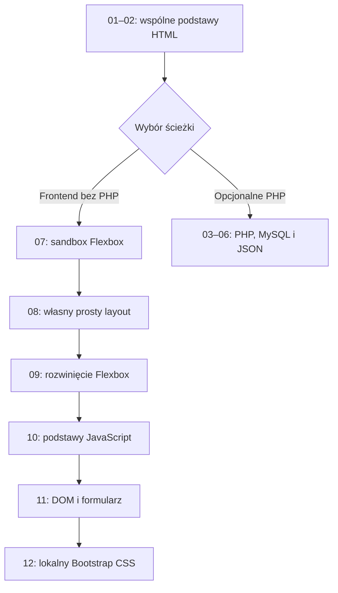

# 2026-09-07 — rozszerzenie kursu o Flexbox, JavaScript i lokalny Bootstrap

## Purpose

Rozbudować `web-grounding` o pełną ścieżkę frontendową, z której można korzystać bez PHP: od dwóch lekcji HTML, przez Flexbox i JavaScript, po stronę zbudowaną na lokalnym pliku Bootstrap CSS. Każda lekcja ma samodzielny README opisujący użyte elementy HTML, właściwości i wartości CSS, konstrukcje JavaScript oraz biblioteki.

## Scope and constraints

- Zachowano istniejące lekcje PHP `03`–`06` jako osobną, opcjonalną ścieżkę.
- Nowa ścieżka nie wymaga PHP, XAMPP, npm ani połączenia z internetem.
- Bootstrap jest przechowywany w repozytorium jako CSS; lekcja nie pobiera go z CDN i nie używa JavaScriptu Bootstrapa.
- Zakres obejmuje lokalne materiały dydaktyczne i ich weryfikację w Chromium. Nie wykonano wdrożenia ani publikacji.
- Nie znaleziono jednoznacznego mapowania projektu w Linear lub Notion, więc nie wykonano zewnętrznych zapisów.

## Acceptance criteria

- README główny przedstawia dwie ścieżki: frontend `01 → 02 → 07 → 08 → 09 → 10 → 11 → 12` oraz opcjonalne PHP `01 → 02 → 03 → 04 → 05 → 06`.
- Lekcje `07`–`09` uczą osi głównej i poprzecznej, `gap`, `flex-grow`, zawijania oraz prostych rozszerzeń Flexboxa.
- Lekcja `07` pozwala wyklikiwać warianty układu bez JavaScriptu.
- Lekcje `10`–`11` wprowadzają podstawy JavaScriptu, DOM, zdarzenia i walidację formularza.
- Lekcja `12` buduje stronę z lokalnego pliku Bootstrap CSS bez odwołania do CDN.
- Każdy README lekcji zawiera szczegółowe sekcje HTML, CSS, JavaScript i Biblioteki; lekcje PHP dodatkowo opisują PHP.
- Nowe strony działają przy szerokości 390 px i 1440 px, bez wykrytych problemów układu, WCAG lub błędów runtime w zakresie wykonanych audytów.

## Starting evidence

- Kurs zawierał lekcje `01`–`06`: dwa wprowadzenia HTML i cztery lekcje PHP/MySQL.
- Główny README prowadził przede wszystkim do ścieżki wymagającej XAMPP.
- Test kontraktu wymagał 13 plików i nie obejmował słowników użytych elementów, właściwości, wartości ani bibliotek.
- Po rozszerzeniu testu, a przed dodaniem materiałów, `node tests/validate-course.mjs` zgłosił oczekiwany brak nowych lekcji, assetów i sekcji README.

## Investigation or execution method

Najpierw ustalono rozdział dwóch ścieżek i kontrakt każdej nowej lekcji. Test kontraktu rozszerzono przed implementacją, uzyskując czerwony wynik. Następnie dodano materiały, lokalny asset Bootstrap, dokumentację i poprawki responsywności. Weryfikacja objęła test kontraktu, kontrolę składni JavaScript, integralność assetu, audyty przeglądarkowe, interakcje myszą i klawiaturą oraz zachowanie formularza DOM.

## Root causes and decisions

- Obserwacja: obowiązkowa kontynuacja PHP ograniczała użyteczność kursu dla uczniów zainteresowanych frontendem. Decyzja: po lekcji `02` rozdzielić kurs na równoległe ścieżki.
- Obserwacja: oś główna i poprzeczna są łatwiejsze do zrozumienia przez natychmiastową zmianę układu. Decyzja: lekcja `07` używa kontrolek formularza i selektora `:has()` jako bezskryptowego sandboxa.
- Obserwacja: sam wykaz tematów nie wyjaśnia składni początkującym. Decyzja: każdy README zawiera tabele elementów, atrybutów, właściwości, wartości, konstrukcji i bibliotek użytych w danej lekcji.
- Obserwacja: domyślne kontrolki sandboxa, linki lekcji `08` i kontrolki Bootstrap były zbyt małe dla wygodnej obsługi dotykowej. Decyzja: zwiększyć ich rzeczywiste pola interakcji do co najmniej około 44 px.
- Obserwacja: `order` może rozjechać porządek wizualny i klawiaturowy. Decyzja: pokazać tę właściwość dopiero w lekcji `09` wraz z ostrzeżeniem dostępnościowym.
- Obserwacja: CDN przeczyłby celowi lekcji offline. Decyzja: przypiąć Bootstrap `5.3.8` jako lokalny CSS i zachować jego licencję.

## Implementation sequence

1. Rozszerzono fail-first test kontraktu z 13 do 34 wymaganych plików.
2. Dodano lekcję `07` z wyklikiwanym sandboxem Flexbox.
3. Dodano lekcję `08` z prostym układem strony oraz `09` z zawijaniem, skrótem `flex`, `align-self` i `order`.
4. Dodano lekcję `10` z podstawami języka JavaScript oraz `11` z obsługą DOM i formularza.
5. Dodano lekcję `12` i lokalne pliki Bootstrap `5.3.8` wraz z licencją.
6. Rozbudowano README lekcji `01`–`06`, główny README oraz instrukcję ucznia.
7. W przeglądarce skorygowano rozmiary pól interakcji i powtórzono audyty mobilne oraz desktopowe.

## Flow diagram

## Files and boundaries changed

- Zmieniono README lekcji `01`–`06`, główny `README.md`, `STUDENT_SETUP.md` i `tests/validate-course.mjs`.
- Dodano kompletne foldery lekcji `07`–`12`.
- Dodano `assets/bootstrap/bootstrap.min.css` i `assets/bootstrap/LICENSE`.
- Nie zmieniono implementacji PHP, dumpa SQL ani konfiguracji serwera.
- Zmiany są lokalne na gałęzi `main`; nie wykonano commita, wdrożenia, publikacji ani synchronizacji Linear/Notion.

## Verification evidence

- Test czerwony: rozszerzony `node tests/validate-course.mjs` przed implementacją wskazał brak nowych artefaktów i sekcji.
- Test zielony po ostatnich poprawkach: `PASS: kontrakt kursu (34 wymaganych plików)`.
- `node --check` dla skryptów lekcji `06`, `10` i `11`: exit `0`.
- Bootstrap CSS: `232111` bajtów; licencja: `1093` bajty; SHA-384 Base64: `sRIl4kxILFvY47J16cr9ZwB07vP4J8+LH7qKQnuqkuIAvNWLzeN8tE5YBujZqJLB`.
- Lekcja `07`: wybrano kierunek kolumnowy, wyśrodkowanie na obu osiach, duży odstęp i wzrost drugiego elementu; wszystkie kontrolki zadziałały.
- Lekcja `10`: konsola pokazała `Uczeń: Ola`, `Średnia: 4.00` i `Wynik: zaliczone`, bez komunikatów błędu.
- Lekcja `11`: dodanie zadania ustawiło licznik na `1`; wpis z samych spacji wyświetlił `Wpisz nazwę zadania.`.
- Lekcja `12`: sieć przeglądarki zawierała stronę i lokalne żądanie `/assets/bootstrap/bootstrap.min.css` z odpowiedzią `200`, bez żądania do CDN.
- Chromium 390 × 844: lekcje `07`–`12` miały po `0` wykrytych problemów visual layout, WCAG 2.1 i runtime po ostatnich poprawkach.
- Chromium 1440 × 900: końcowe audyty `07`, `08` i `12` oraz wcześniejsze audyty `09`–`11` miały po `0` wykrytych problemów visual layout, WCAG 2.1 i runtime.
- Nawigację klawiaturą sprawdzono w sandboxie, formularzu DOM, linkach layoutu oraz formularzu i przyciskach Bootstrap.

## Caveats and inconclusive checks

- Dowód przeglądarkowy dotyczy Chromium; nie wykonano osobnych przebiegów w Firefox i Safari.
- PHP/XAMPP pozostają poza zakresem tej zmiany. Dynamiczne lekcje `03`–`06` nie zostały ponownie uruchomione.
- Audyt focus używa selektorów zbiorczych dla powtarzających się linków, dlatego dłuższe automatyczne przebiegi mogły zgłaszać pozorne powtórzenie; ręczne przejście klawiszem Tab przez objęte kontrolki zakończyło się poprawnie.
- Lokalny serwer Python służył wyłącznie do sprawdzenia statycznej ścieżki frontendowej i nie dowodzi działania PHP ani środowiska produkcyjnego.

## Remaining boundary and production closure

- Dla udowodnionego lokalnego zakresu frontendowego nie są wymagane dalsze kroki.
- Recommended: przed szerokim użyciem na różnych stanowiskach wykonać krótki smoke w Firefox i Safari lub ich odpowiednikach dostępnych w pracowni.
- Optional: gdy ścieżka PHP będzie potrzebna, osobno uruchomić XAMPP, import bazy i dynamiczne lekcje `03`–`06` zgodnie z `STUDENT_SETUP.md`.
