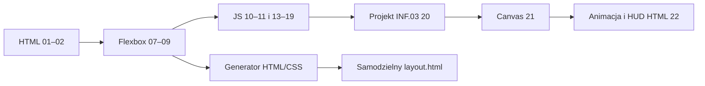

# 2026-09-08 — Flexbox generator i progresja JavaScript do Canvas/HUD

## Purpose
Wdrożyć zaakceptowany plan: czytelne osie i generator Flexbox, 12 małych etapów JavaScript pod INF.03 oraz Canvas z absolutnie pozycjonowanym HUD HTML.

## Scope and constraints
Zachowano foldery 01–12. Progresja JS: 10, 11, 13–22; 12 pozostaje dodatkiem Bootstrap. Lekcje działają jako lokalne HTML/CSS/JS. Bez zależności wymaganych od ucznia. Nie zmieniono wykonawczego PHP ani lokalnego Bootstrapa. Brak ustalonego dokładnego mapowania Linear/Notion: bez zapisów zewnętrznych.

## Acceptance criteria
| AC / PIT | Status | Dowód |
| --- | --- | --- |
| AC-01 / PIT-03 | PASS | Osie row/column/reverse i wrap-reverse, 0–20 dzieci, reset, kontrolki rodzica i dziecka |
| AC-02 / PIT-18 | PASS | Pięć presetów; zgodność właściwości i geometrii eksportu; bezpieczny tekst; pobranie layout.html |
| AC-03 / PIT-02 | PASS | 12 etapów JS, projekt start/rozwiązanie, README i lokalne odnośniki |
| AC-04 / PIT-03 | PASS | Formularze, pusty/błędny wpis, filtry, duplikaty i usuwanie; uszkodzony/niedostępny Storage |
| AC-05 / PIT-21 | PASS | DPR 2, rysowanie, brak obrazu/Canvas, ruch, punkty, życie, pauza, restart, blur, klawiatura i dotyk |
| AC-06 / PIT-09 | PASS | 15 stron × 390×844 i 1440×900; 0 wykrytych naruszeń axe WCAG A/AA; HTTP i file:// |

## Starting evidence
Sandbox 07 miał cztery stałe dzieci i kontrolki CSS :has. Nie obsługiwał wrap, dodawania dzieci ani eksportu. Lekcja 10 łączyła podstawy z tablicami i pętlami, a 11 od razu budowała dynamiczną listę. Przed zmianami worktree był czysty.

## Investigation or execution method
Odczytano obecne lekcje, instrukcję ucznia i test kontraktu. LSP nie był dostępny w tej sesji. Zastosowano bezpośredni odczyt znanych plików, ograniczone rg, testy Node oraz rzeczywistą przeglądarkę Chromium przez Playwright. Dane testowe są lokalnymi przykładami kursu.

## Root causes and decisions
- Nadmiar nowych pojęć na początku: odciążono 10–11, przeniesiono tablice i dynamiczną listę do 16 i 18.
- Generator wymaga dynamicznych dzieci: 07 używa JS jako implementacji narzędzia, niewymaganej jeszcze od ucznia CSS.
- Eksport ma ten sam stan i style co podgląd; test porównuje także współrzędne i rozmiary dzieci.
- Podgląd pozostaje obok kontrolek na desktopie dzięki sticky; na wąskim ekranie celowy overflow jest ograniczony do podglądu.
- Screenshot pokazał przykrycie początkowej pozycji gracza przez HUD na telefonie: przyciski przeniesiono na dół nakładki.
- Axe wykrył białe linki nowej nawigacji 08 na jasnym tle: regułę zawężono do .site-header.
- Test kopiowania wymagał oczekiwania na asynchroniczny wynik schowka; dodano oczekiwanie na komunikat.

## Implementation sequence
1. Zapisano kryteria AC/PIT.
2. Dodano progresję lekcji 10–19 i lokalny słownik CSS.
3. Przebudowano 07: osie, wrap, rodzic/dzieci, presety, eksport i objaśnienia.
4. Dodano projekt 20 z wariantem startowym oraz 21–22 Canvas/HUD.
5. Rozwinięto 08–09 o zagnieżdżenia i porównanie align-items/align-content.
6. Zaktualizowano mapę, README i instrukcję ucznia; sformatowano kod.
7. Przeprowadzono browser proof, poprawki geometrii/kontrastu i końcowy przebieg.

## Flow diagram

## Files and boundaries changed
Foldery 07–11, nowe 13–22, assets/lessons (3 lokalne SVG), README, STUDENT_SETUP, docs/css-lekcji.md, docs/acceptance-frontend.md, tests/validate-course.mjs i tests/frontend-browser.cjs. Instrukcja autora: tests/README.md. Artefakty i zależności testowe znajdują się w ignorowanym .test-results. Użytkownik zlecił commit rozszerzenia wraz z poniższymi korektami 07/09. Hash commita jest dostępny w historii Git; push nie jest częścią tego domknięcia.

## Verification evidence
- node tests/validate-course.mjs: exit 0, PASS 82 wymagane pliki; kontrola lokalnych odnośników.
- node --check: PASS 16 plików JS/CJS.
- node tests/frontend-browser.cjs: exit 0, PASS 240 asercji.
- Chromium: 390×844 i 1440×900, DPR 2; lokalny HTTP na automatycznie wybranym porcie 127.0.0.1 i file://.
- Axe: 30 przebiegów (15 stron × 2 szerokości), zero wykrytych naruszeń wcag2a/wcag2aa/wcag21aa po poprawce.
- Sterowanie dotykowe: Chromium mobile context i zdarzenia touch, zbieranie celu i pauza.
- Eksport: pięć presetów, kontrola CSS i geometrii, tekst zawierający znaczniki pozostaje tekstem, pobieranie pliku.
- git diff --check: exit 0 po formatowaniu.
- Obejrzano końcowe screenshoty sandboxa desktop, HUD mobile i projektu 20 desktop.
- Test zamyka własny serwer oraz przeglądarkę w finally.

## Caveats and inconclusive checks
Nie badano Firefox/Safari, fizycznego telefonu ani rzeczywistego czytnika ekranu. Axe nie stanowi pełnego audytu WCAG. Statyczny serwer nie wykonuje PHP; PHP/XAMPP pozostają poza zakresem. Canvas to rozszerzenie edukacyjne, a projekt 20 jest autorskim ćwiczeniem, nie oficjalnym arkuszem.

## Remaining boundary and production closure
Lokalny zakres zaakceptowanego planu został zweryfikowany. Dalsze kroki nie są wymagane dla tego zakresu. Publikacja/GitHub i dodatkowe przeglądarki pozostają odrębnymi czynnościami.

## Korekta 07/09 na podstawie uwag użytkownika

- 07: aktualny CSS rodzica i wybranego dziecka pod kontrolkami; wspólny generator stylów z eksportem, aktualizacja po zmianie wyboru i komunikat przy 0 dzieci.
- 07: bezpośrednie objaśnienie align-items vs align-content, komunikat zależny od nowrap/wrap i link do porównania.
- 09: trzy stany o identycznych wymiarach i różnych wysokościach dzieci (48/88px). Najpierw zmienia się tylko align-items, potem tylko align-content. Widoczne ramki, podpisy, CSS oraz HTML do odtworzenia.
- 09: order opisane jako osobne zagadnienie, numery listy przeniesione do wnętrza kafelków.
- Test geometrii przy obu szerokościach potwierdza ruch krótkich dzieci o 20px oraz wspólny ruch drugiej linii o 44px.
- Testy: PASS 257 asercji przeglądarkowych, PASS kontrakt 82 plików, poprawna składnia i diff --check. Obejrzano screenshoty 09 desktop i 07 mobile.
