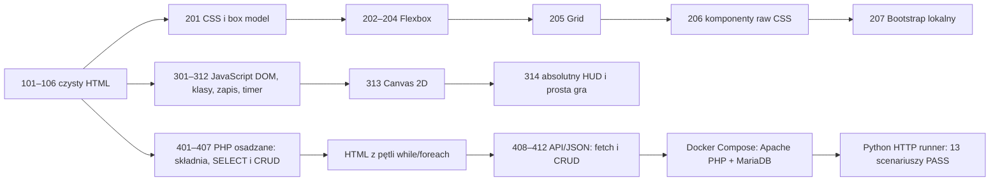

# 2026-09-16 — kanoniczne serie kursu 1xx–4xx i progresja Canvas/PHP

## Purpose

Uporządkować kurs web-grounding według tematów: czysty HTML `1xx`, CSS/Flexbox/
Grid `2xx`, JavaScript/Canvas `3xx` oraz PHP/MySQL/JSON `4xx`. Dodać lekcje,
które prowadzą od małych modyfikacji do pełnych zadań INF.03, bez usuwania
wcześniejszych ścieżek zgodności. W rewizji z 2026-09-16 PHP zostało rozdzielone
na osadzane renderowanie `401–407` i późniejszy dodatek API `408–412`.

## Scope and constraints

- Kanoniczne serie obejmują 39 lekcji: 6 HTML, 7 CSS, 14 JavaScript/Canvas i 12 PHP
  (7 osadzanych oraz 5 API/JSON).
- Stare foldery pozostają lokalnymi aliasami. Pliki API, które wcześniej
  znajdowały się obok lekcji osadzanych, przeniesiono przez kopię do `408–412`,
  więc działanie zachowano bez mieszania dwóch sposobów renderowania.
- Seria `1xx` jest czystym HTML bez CSS i JavaScriptu.
- Bootstrap jest ładowany wyłącznie z `assets/bootstrap/bootstrap.min.css`.
- PHP można uruchomić przez XAMPP/MySQL albo przez jednorazowy Docker Compose z Apache,
  `mysqli` i MariaDB; nie wykonywano wdrożenia ani zmian w zewnętrznych systemach.
- Duże archiwa egzaminacyjne pozostają poza śledzeniem zgodnie z `.gitignore`.
- W odczytanych bazach AKS, Projects i Linear nie znaleziono jednoznacznego
  rekordu `web-grounding`; zgodnie z regułą nie tworzono ani nie aktualizowano
  zewnętrznego projektu/tasku. Ten lokalny wpis jest handoffem `sync-pending`.

## Acceptance criteria

| ID | Kryterium | Status | Dowód |
| --- | --- | --- | --- |
| AC-01 | Kanoniczne lekcje i README mają wymagany kontrakt. | PASS | `node tests/validate-course.mjs` — `39 canonical lessons + aliases`. |
| AC-02 | Sandbox wyjaśnia main/cross axis, wrap, gap, justify, grow, child oraz CSS rodzica/dziecka. | PASS | Chrome przez lokalny HTTP: stan `wrap + center + space-between`, szerokość 260 px, dodanie dziecka i aktualny eksport `.layout`/`.item-5`. |
| AC-03 | Lekcja 204 jasno rozdziela `align-items` (dzieci w linii) i `align-content` (całe linie). | PASS | AX tree pokazuje trzy porównywalne panele, kod obu stanów i opis ruchu krótszych dzieci vs drugiej linii. |
| AC-04 | JavaScript prowadzi przez klasy/theme, timer, Canvas i HUD/gra. | PASS | Chrome: theme zmienił stan na „Motyw ciemny”, timer `01:00 → 00:59`, Canvas ma scenę, HUD ma punkty/życia/pauzę/restart. |
| AC-05 | Bootstrap działa lokalnie bez CDN. | PASS | Browser evaluate potwierdził stylesheet `/assets/bootstrap/bootstrap.min.css`; strona 207 wyrenderowała formularz i karty. |
| AC-06 | Dokumentacja, plan INF.03/INF.04, generator 9xx i testy są spięte z nowymi ścieżkami. | PASS | `README.md`, `STUDENT_SETUP.md`, `docs/plan-nauki-inf03-inf04.md`, README lekcji oraz zaktualizowane testy. |
| AC-07 | Składnia JavaScriptu i białe znaki przechodzą kontrolę. | PASS | `node --check` dla 18 plików; `git diff --check` bez błędów treści. |
| AC-08 | PHP osadzane i API działają z seedowaną bazą w izolowanym kontenerze. | PASS | `tests/php-container/test_lessons.py` — 13 PASS w przebiegu `--build` i 13 PASS w przebiegu `--no-build`; oba serwisy `healthy`. |

## Starting evidence

Repozytorium zawierało wcześniejsze lekcje `01–22`, rozproszone przykłady PHP,
Flexbox/Canvas i materiały egzaminacyjne. Numeracja nie tworzyła jednej ścieżki
tematycznej, a nowe zadania wymagały doprecyzowania kryteriów i linków.

## Investigation or execution method

Odczytano AKS `00–05` oraz Hub i sprawdzono Projects/Linear; nie było rekordu
`web-grounding`, więc synchronizację zewnętrzną pozostawiono bez zapisu.
Przejrzano znane pliki kursu, README, generator, dokumentację egzaminacyjną i
testy. Zmiany wprowadzono przez `apply_patch` oraz zachowawcze skopiowanie
istniejących lekcji API do nowych, kanonicznych folderów `408–412`; z folderów
osadzanych usunięto tylko powielone pliki API. Następnie uruchomiono
walidator kontraktu, kontrolę składni Node i lokalny serwer HTTP; interakcje
sprawdzono w Chrome przez drzewo dostępności, DOM oraz screenshot HUD.
Po dodaniu kontraktu kontenerowego zbudowano obraz PHP z `mysqli`, uruchomiono
MariaDB z `database/web_grounding.sql` i przejechano bez-dependency runnerem
Python pełny przepływ formularzy oraz API. Sprawdzono również `--no-build`,
zdrowie usług, etykiety Compose, montowania `ro`, logi bez sekretów i cleanup
wyłącznie nazwanego projektu testowego.

## Root causes and decisions

- Obserwowana potrzeba: uczeń bez PHP ma móc przejść pełny frontend. Decyzja:
  osobna numeracja `1xx–3xx`, a PHP jako opcjonalna seria `4xx`.
- Obserwowany problem Flexboxa: `align-items` i `align-content` były trudne do
  odróżnienia. Decyzja: sandbox pokazuje oba CSS-y na żywo, a lekcja 204 ma trzy
  identyczne kontenery z jedną zmianą na panel.
- Obserwowany problem nawigacji: kopiowane lekcje wskazywały stare numery. Decyzja:
  kanoniczne linki prowadzą przez HTML → CSS → JS → Canvas oraz PHP osadzane
  `401–407` → API/JSON `408–412`; stare ścieżki zachowano jako aliasy.
- Ograniczenie środowiska: brak hostowego PHP i Playwright. Decyzja: nie instalować
  PHP na hoście; dodać reprodukowalny test Docker + Python, zachowując jasną
  granicę między lokalnym dowodem kontenerowym a XAMPP/produkcją.

## Implementation sequence

1. Dodano HTML `102–106` oraz zrewidowano tabelę, formularze, media i dostępność.
2. Uporządkowano CSS `201–207`: box model, sandbox Flexbox, Grid, komponenty raw CSS i Bootstrap lokalny.
3. Dodano progresję JavaScript `303–312`, projekt INF.03 oraz Canvas `313–314` z HUD-em absolutnym.
4. Przeniesiono PHP do kanonicznego CRUD `401–407` z renderowaniem HTML,
   prepared statements i iteracją rekordów; API/JSON przeniesiono do osobnej
   końcówki `408–412`.
5. Zaktualizowano README, instrukcję ucznia, plan nauki, generator 9xx oraz testy autora.
6. Dodano `tests/php-container`: Dockerfile PHP + `mysqli`, Compose z MariaDB,
   runner HTTP w Pythonie i wrapper PowerShell; połączenia PHP przyjmują zmienne
   `DB_*` z fallbackiem zgodnym z XAMPP.

## Flow diagram

## Files and boundaries changed

- Nowe kanoniczne katalogi lekcji `101–106`, `201–207`, `301–314`, `401–407`
  oraz `408–412`.
- `README.md`, `STUDENT_SETUP.md`, `docs/css-lekcji.md` i `docs/plan-nauki-inf03-inf04.md`.
- `tests/validate-course.mjs` i `tests/frontend-browser.cjs`.
- `tests/php-container/Dockerfile`, `compose.yml`, `test_lessons.py`,
  `run-tests.ps1` i README oraz wpis cache w `.gitignore`.
- Zachowane katalogi zgodności, `docs/inf03`, `docs/inf04`, lekkie paczki oraz lokalny Bootstrap.

## Verification evidence

- `node tests/validate-course.mjs` — PASS: 39 lekcji kanonicznych + aliasy oraz lokalne odnośniki.
- Walidator wymusza także kolejność PHP osadzanego `401–407` przed API `408–412`
  w README, instrukcji ucznia i planie nauki oraz odrzuca pliki API w folderach
  osadzanych.
- `node --check` — PASS: 56 plików JavaScript, w tym test autora.
- Chrome/local HTTP — PASS: sandbox Flexbox, porównanie 204, theme, timer, Canvas,
  HUD/gra, Bootstrap oraz statyczne strony 408/409 z nową nawigacją API.
- Docker/Compose — PASS (`container-proven`):
  `docker compose -p web-grounding-php-test -f tests/php-container/compose.yml up -d --build`
  zbudował obraz `php:8.3-apache` + `mysqli`; `python tests/php-container/test_lessons.py`
  zwrócił 13 PASS, a `docker compose ps` pokazał `db healthy` i `php healthy`.
  Po świeżym wolumenie ten sam runner zwrócił 13 PASS po
  `up -d --no-build`. Wrapper `run-tests.ps1 -NoBuild` również zwrócił 13 PASS
  i usunął wyłącznie nazwany projekt; końcowe `compose ps`, `docker volume ls`
  i `docker network ls` nie zwróciły pozostałości.
- Kontrakt montowań — PASS: `docker inspect` potwierdził etykiety projektu/usługi,
  SQL jako `ro` oraz całe repozytorium jako `ro` w serwisie PHP; logi nie zawierały
  sekretów (jedynie nieblokujące ostrzeżenia środowiska Docker/MariaDB).
- Git delivery — PASS: `git push origin features/v2`, a następnie
  `git ls-remote --heads origin features/v2` zwrócił
  `e36d4027ea4676758fb0cc21b4b10080530534db` przed bieżącym commitem;
  bieżący commit lokalny to `30e2aa77b62ddf5c85671d4e508a631281852581`.
- `git diff --check` — brak błędów treści; Git zgłosił tylko ostrzeżenia LF/CRLF i brak dostępu do globalnego ignore.

## Caveats and inconclusive checks

- `node tests/frontend-browser.cjs` jest BLOCKED: moduł `playwright` nie jest zainstalowany (`MODULE_NOT_FOUND`).
- Hostowe `php -l` nadal jest BLOCKED: brak `php.exe`, Apache i MySQL poza Dockerem;
  składnia i żądania kanonicznych lekcji są jednak zweryfikowane w kontenerze PHP 8.3.
- Sprawdzenie Chrome było lokalne; nie jest dowodem wdrożenia, hostingu ani produkcji.
- Wcześniejsza dostawa jest zapisana w commitach `a1f7d5e` i `b0eb6d8`.
  Rewizję numeracji PHP zapisano w `68cab8e`, porządkowanie końców plików
  w `e195398`, a aktualizację handoffu w `56d3c1f`; wszystkie są na
  `features/v2`, a zdalny ref został sprawdzony bezpośrednio.

## Remaining boundary and production closure

Przed uznaniem serii PHP za uruchomioną w środowisku ucznia trzeba jeszcze w XAMPP
zaimportować `database/web_grounding.sql` i sprawdzić lokalne ustawienia użytkownika
MySQL; kontener nie jest dowodem konfiguracji XAMPP ani wdrożenia. Opcjonalnie
należy doinstalować zależności autora i uruchomić `node tests/frontend-browser.cjs`.
Brak działań produkcyjnych pozostaje zamierzony. Synchronizacja do Linear/Notion
pozostaje `sync-pending`, ponieważ nie ma zweryfikowanego mapowania repozytorium
na projekt.
Sam kod, dokumentacja i kontrakt testowy są zatwierdzane osobno; bieżący commit
zostanie wypchnięty po tej aktualizacji notatki i zdalny ref będzie sprawdzony
bezpośrednio.
