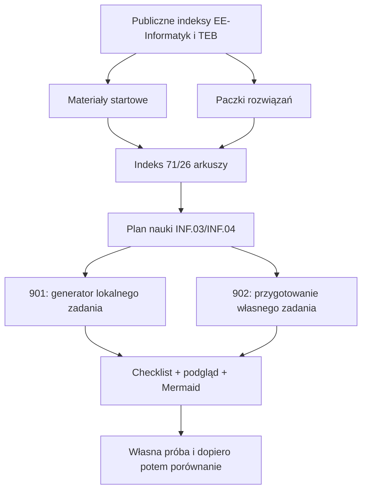

# 2026-09-14 — materiały INF.03/INF.04 i lokalne generatory 9xx

## Purpose

Uzupełnić lokalny zestaw egzaminacyjny o publiczne paczki rozwiązań, opisać
zakres zadań INF.03/INF.04 oraz dodać offline'ową serię 9xx do generowania
lokalnych mini-arkuszy z instrukcją przygotowania i diagramem Mermaid.

## Scope and constraints

- Zachowano 71 katalogów zadań INF.03 i 26 katalogów INF.04.
- Pobrano tylko publiczne pliki z EE-Informatyk i repozytorium TEB; nie
  pobierano materiałów z zamkniętych bibliotek.
- `pliki.zip`/archiwa materiałów są oddzielone od paczek rozwiązań.
- Seria 9xx działa bez PHP, npm, CDN i bibliotek zewnętrznych.
- Pojedyncze archiwum większe niż 5 MiB jest jawnie ignorowane przez Git, ale
  pozostaje na dysku. Lżejsze archiwa pozostają możliwe do śledzenia.
- Oficjalne PDF-y CKE pozostają źródłem wymagań; lokalny generator tworzy
  autorskie zadania treningowe, nie kopię arkusza.

## Acceptance criteria

| AC | Status | Dowód |
| --- | --- | --- |
| AC-01: paczki z materiałami startowymi są lokalnie dostępne | PASS | 71 katalogów INF.03; 26 katalogów INF.04; 11 centralnych archiwów materiałów INF.04 |
| AC-02: paczki rozwiązań są oddzielone i opisane | PASS | 70 `rozwiazanie.zip` INF.03 (106,9 MB) oraz 37 archiwów TEB INF.04 (22 ZIP + 15 7z, 255,2 MB) |
| AC-03: ciężkie paczki nie trafiają przypadkiem do Git | PASS | `git ls-files --others --exclude-standard`: 203 nieignorowane archiwa, 0 powyżej 5 MiB; 16 ciężkich ścieżek w `.gitignore` |
| AC-04: spis zadań i zagadnień jest lokalny | PASS | `docs/plan-nauki-inf03-inf04.md`, indeksy 71/26 i linki w README |
| AC-05: generator 901 tworzy zadanie, checklistę i Mermaid | PASS | lokalna przeglądarka: INF.04/OOP, ziarno 7, wynik i `flowchart LR` |
| AC-06: kreator 902 tworzy Markdown, Mermaid i etapy | PASS | lokalna przeglądarka: 7 kryteriów, 5 etapów, dodanie/usunięcie etapu, wynik Markdown + `flowchart TD` |
| AC-07: dokumentacja i kontrakt kursu są poprawne | PASS | 90 wymaganych plików, 371 lokalnych odnośników bez błędów, `git diff --check` bez błędów |

## Starting evidence

Repozytorium zawierało kurs lekcji 01–22 oraz indeksy arkuszy, ale nie miało
oddzielnych paczek rozwiązań ani serii 9xx. Materiały INF.04 były opisane jako
same pliki startowe. Worktree pozostawał współdzielony i zawierał wcześniejsze
zmiany dokumentacji, które zostały zachowane.

## Investigation or execution method

Odczytano istniejące README, kontrakt `tests/validate-course.mjs` i test
przeglądarkowy. Publiczny indeks EE-Informatyk posłużył do pobrania rozwiązań
INF.03, a API drzewa publicznego repozytorium GitHub TEB do pobrania 37
archiwów INF.04. Utworzono lokalny serwer HTTP tylko na czas sprawdzenia stron
901/902 w Chrome. Test Playwright z repozytorium nie uruchomił się, ponieważ
środowisko nie zawiera modułu `playwright`; nie instalowano zależności ucznia.

## Root causes and decisions

- Materiały startowe i gotowy kod mają różną rolę dydaktyczną; dlatego zapisano
  je w `arkusze`/`materialy` oraz osobnych `rozwiazania`/`rozwiazania-teb`.
- Nie każdy wariant INF.04 ma publiczne rozwiązanie; dokumentacja podaje 37
  wybranych paczek TEB zamiast sugerować kompletność.
- Limit 5 MiB jest prostą, audytowalną regułą dla Git; wpisy są jawne, bo
  `.gitignore` nie potrafi filtrować po rozmiarze.
- PDF-y są potrzebne do wiernego odczytu wymagań, ale generator 9xx daje
  wygodną, lokalną wersję ćwiczeniową bez zależności od PDF-u.

## Implementation sequence

1. Pobrano i uporządkowano paczki rozwiązań INF.03 i INF.04.
2. Dodano README katalogów rozwiązań oraz mapowanie materiałów.
3. Dodano plan nauki z rodzinami zadań i checklistami INF.03/INF.04.
4. Dodano lekcję 901 (generator) i 902 (kreator własnego mini-arkusza).
5. Wpięto serię 9xx do mapy kursu, indeksu egzaminów i testów kontraktowych.
6. Dodano jawne wyjątki dużych archiwów do `.gitignore`.
7. Zweryfikowano archiwa, linki, składnię JS i działanie w lokalnej
   przeglądarce.

## Flow diagram

## Files and boundaries changed

- `.gitignore` — 16 jawnych ścieżek archiwów powyżej 5 MiB.
- `901-generator-zadan/` — HTML/CSS/JS/README generatora.
- `902-przygotowanie-zadania/` — HTML/CSS/JS/README kreatora.
- `docs/plan-nauki-inf03-inf04.md` — spis zadań i zagadnień.
- `docs/inf03/`, `docs/inf04/`, `docs/egzaminy-inf03-inf04.md` — indeksy,
  materiały i rozwiązania.
- `README.md`, `tests/validate-course.mjs`, `tests/frontend-browser.cjs` —
  mapa kursu i obsługa nowych lekcji.

Pobrane binaria pozostają lokalnie. Nie wykonano commit ani push; worktree jest
celowo niezatwierdzony do czasu decyzji użytkownika.

## Verification evidence

- `node --check 901-generator-zadan/app.js` — exit 0.
- `node --check 902-przygotowanie-zadania/app.js` — exit 0.
- `node --check tests/frontend-browser.cjs` — exit 0.
- `node tests/validate-course.mjs` — exit 0, PASS: 90 wymaganych plików.
- Walidacja archiwów — 219 plików, `ZIP_BAD=0`, `SEVENZIP_BAD=0`, `ZERO=0`.
- Lokalny checker Markdown — 43 pliki, 371 linków, `BAD=0`.
- Chrome przez lokalny HTTP — 901 generuje INF.04/OOP i Mermaid; 902 renderuje
  kryteria/etapy, obsługuje dodanie/usunięcie i generuje Markdown/Mermaid.
- `git ls-files --others --exclude-standard` — 0 nieignorowanych archiwów
  powyżej 5 MiB.
- `git diff --check` — exit 0; Git zgłasza wyłącznie ostrzeżenie o konwersji
  LF→CRLF i brak dostępu do globalnego pliku ignore użytkownika.

## Caveats and inconclusive checks

`node tests/frontend-browser.cjs` jest przygotowany także dla lekcji 901/902,
ale nie został wykonany, bo w środowisku brakuje pakietu `playwright`. Dowód
runtime pochodzi z rzeczywistego Chrome na lokalnym serwerze, nie z produkcji.
Nie wykonano audytu Firefox/Safari ani pełnego testu czytnika ekranu. Mermaid
jest prezentowany jako kod i prosty podgląd CSS; repozytorium nie dodaje
zewnętrznego renderera Mermaid.

## Remaining boundary and production closure

Zakres lokalnych materiałów, dokumentacji i serii 9xx jest zamknięty i
zweryfikowany. Nie ma dowodu commit/push ani wdrożenia produkcyjnego. Następny
krok wymaga osobnej decyzji: commit/push wybranych lekkich plików albo dalsze
lokalne pobieranie. Nie należy traktować generatora jako oficjalnego arkusza.
