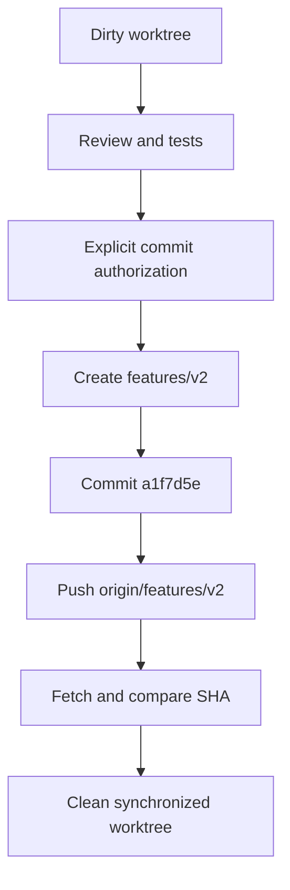

# 2026-09-15 — review, commit i push `features/v2`

## Purpose

Zamknąć dostawę bieżącego zakresu `web-grounding` po review, commitowaniu i
publikacji na osobnym branchu funkcjonalnym.

## Scope and constraints

- Zakres obejmował cały aktualny worktree: 596 plików, w tym lekcje 1xx–4xx,
  generatory 9xx, dokumentację, testy oraz materiały referencyjne PDF/ZIP.
- Docelowy branch został przyjęty jako `features/v2`; wcześniej nie istniał
  lokalnie ani na `origin`.
- Review było niemutujące do momentu jawnego polecenia commitowania.
- PHP/XAMPP i Playwright nie były dostępne w środowisku.

## Acceptance criteria

| ID | Kryterium | Status | Dowód |
| --- | --- | --- | --- |
| AC-01 | Review bieżącego zakresu | CONDITIONAL | `node tests/validate-course.mjs` PASS; `node --check` PASS dla 55 JS; ustalenia P2 opisane poniżej |
| AC-02 | Commit całego zaakceptowanego worktree | PASS | `a1f7d5e feat: add INF.03 and INF.04 course materials`, 596 plików |
| AC-03 | Push na `features/v2` | PASS | `git push -u origin features/v2`; `HEAD` i `origin/features/v2` = `a1f7d5eaad7e895a5f536f12bdc0996d11aa917c` |
| AC-04 | Czysty stan po publikacji | PASS | `git status --short --branch` → `## features/v2...origin/features/v2` |

## Starting evidence

Worktree był na `main`, zsynchronizowany z `origin/main`, ale zawierał 590
niezacommitowanych plików. Nie było brancha `feature/v2` ani `features/v2` na
remote.

## Investigation or execution method

Wykonano kontrolę statusu/remote, review kontraktu kursu, skan HTML/CSS/JS/PHP,
kontrolę lokalnych odnośników, walidator kursu i sprawdzenie składni JavaScript.
Następnie utworzono `features/v2`, zacommitowano cały zaakceptowany zakres i
zweryfikowano zdalny SHA przez fetch oraz `ls-remote`.

## Root causes and decisions

- Obserwowany zakres obejmował zarówno kod kursu, jak i lokalne materiały
  egzaminacyjne; decyzją użytkownika zacommitowano cały worktree.
- Review wykazał osłabienie części asercji PHP/SQL/JSON w validatorze oraz brak
  pełnych interakcji 901/902 w teście browserowym. Nie poprawiano tego bez
  osobnego polecenia, aby nie mieszać review z implementacją.
- Branch `features/v2` jest gałęzią funkcjonalną; push nie jest dowodem
  wdrożenia ani gotowości produkcyjnej.

## Implementation sequence

1. Sprawdzono status i rozmiar zakresu.
2. Wykonano review i testy dostępne lokalnie.
3. Utworzono branch `features/v2`.
4. Zacommitowano 596 plików jako `a1f7d5e`.
5. Wypchnięto branch i potwierdzono zgodność SHA lokalnego oraz remote.

## Flow diagram

## Files and boundaries changed

- Commit obejmuje lekcje, testy, dokumentację i materiały referencyjne
  opisane w dwóch notatkach sesji z 2026-09-14.
- Ta notatka dokumentuje wyłącznie review i delivery; nie zmienia runtime'u.

## Verification evidence

- `node tests/validate-course.mjs` — PASS: 35 lekcji kanonicznych + aliasy.
- `node --check` — PASS: 55 plików JavaScript.
- `git diff --cached --check` — brak błędów whitespace przed commitem.
- `git push -u origin features/v2` — branch opublikowany.
- `git rev-parse HEAD` = `git rev-parse origin/features/v2` — pełny SHA
  `a1f7d5eaad7e895a5f536f12bdc0996d11aa917c`.

## Caveats and inconclusive checks

- `php -l` nie został wykonany: brak `php.exe`, Apache i MySQL.
- `node tests/frontend-browser.cjs` nie został wykonany: brak modułu
  `playwright`; wcześniejszy lokalny Chrome nie zastępuje ponownego testu tej
  wersji drzewa.
- Review pozostawia P2: osłabiony validator, niepełne testy interakcji 901/902
  oraz niespójność `STUDENT_SETUP.md:3` z lekcjami 313/314.
- Push do brancha nie jest dowodem QA, produkcji ani kompletności PHP/XAMPP.

## Remaining boundary and production closure

Przed traktowaniem zakresu jako gotowego do szerszego wydania należy przywrócić
utracone asercje validatora, dodać browser coverage dla generatorów 901/902,
poprawić zakres numeracji w instrukcji ucznia oraz wykonać `php -l` i testy
XAMPP. Branch został opublikowany jako feature branch, bez wdrożenia produkcyjnego.
