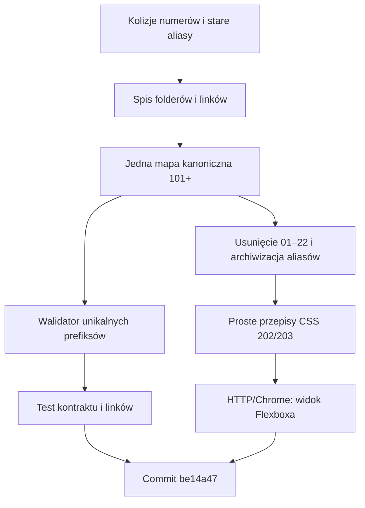

# Sesja 2026-09-20 — unikalna numeracja i prostszy Flexbox

## Cel

Usunąć kolizje numerów lekcji, wycofać foldery poniżej `100` oraz ułatwić
uczniom wejście w Flexbox przez krótkie przykłady czystego CSS.

## Zakres i ograniczenia

- Kanoniczne lekcje `101–412` i generatory `901–902` pozostały na swoich
  ścieżkach.
- Foldery `01–22` usunięto z katalogu głównego.
- Zduplikowane aliasy `102`, `205`, `303–312` i `402`, `404–408` przeniesiono
  do `archive/legacy-lessons/`, aby zachować materiał bez mieszania go z mapą
  kursu.
- Nie dodano bibliotek ani zależności ucznia.

## Kryteria akceptacji

| ID | Kryterium | Status | Dowód |
| --- | --- | --- | --- |
| AC-01 | Brak numerów poniżej `100` w katalogu głównym. | PASS | Kontrola PowerShell + `tests/validate-course.mjs`. |
| AC-02 | Każdy numer ma jeden folder. | PASS | Walidator grupuje prefiksy numeryczne i zgłasza kolizję. |
| AC-03 | Linki kursu prowadzą do kanonicznych nazw. | PASS | `node tests/validate-course.mjs` — 39 lekcji kanonicznych, 2 support lessons. |
| AC-04 | Flexbox pokazuje osie, proporcję 5:7, grow, wrap, gap i rodzic/dziecko. | PASS | Statyczne przykłady w `202` i `203`, opisane README; lokalny Chrome HTTP pokazał oba widoki. |
| AC-05 | Zmiana nie psuje składni JS. | PASS | `node --check` — 41 plików. |
| AC-06 | Zmiana jest zapisana w Git. | PASS | Commit `be14a4716f821b7c911783c65eceef51c1ab026c`. |

## Dowód początkowy i diagnoza

W katalogu głównym występowały grupy z tym samym prefiksem, między innymi
`408-php-api-json`, `408-php-api-usuwanie` i `408-php-json-dodatek`. Ten sam
problem dotyczył serii HTML, CSS, JavaScript/Canvas i PHP. Stare listy aliasów w
walidatorze wymagały tych folderów, więc test nie wykrywał kolizji.

## Decyzje i wykonanie

1. Zostawiono jedną kanoniczną mapę `101+` oraz `901–902`.
2. Dodano automatyczny skan folderów numerycznych do walidatora: prefiks jest
   parsowany niezależnie od tytułu, a prefiks powtórzony lub mniejszy niż `100`
   kończy test błędem.
3. Poprawiono odnośniki progresji JS po usunięciu aliasów.
4. W sandboxie `202` dodano pięć wzorów pure CSS: osie, 5:7, `grow`, `wrap`
   oraz pionowy `header/main/footer`.
5. W `203` dodano trzy przepisy do przepisania: 5:7, `flex-grow: 2` i karty
   z `flex-wrap`; README opisuje wartości i zadania modyfikacyjne.

## Przepływ

## Zmienione granice

- Kurs: `202-css-flexbox-sandbox/`, `203-css-flexbox-wlasny-layout/`.
- Dokumentacja: `README.md`, `STUDENT_SETUP.md`, `docs/css-lekcji.md`,
  `docs/plan-nauki-inf03-inf04.md`.
- Kontrakt: `tests/validate-course.mjs`.
- Archiwum: `archive/legacy-lessons/`.

## Weryfikacja

- `node tests/validate-course.mjs` — PASS: `39 canonical lessons + 2 support lessons; unique numeric prefixes`.
- `node --check` dla 41 plików JS/MJS — PASS.
- `git diff --check` — PASS (wyłącznie ostrzeżenia o konwersji CRLF).
- Lokalny serwer HTTP i Chrome pokazały `202` oraz `203` z widocznymi kartami
  5:7, grow, wrap i kodem do skopiowania.
- `node tests/frontend-browser.cjs` — NIE URUCHOMIONO: środowisko nie ma
  modułu `playwright`; pełny test 390/1440 i axe pozostaje do uruchomienia w
  środowisku autora.

## Pozostała granica i zamknięcie

Commity `be14a4716f821b7c911783c65eceef51c1ab026c` i
`33c7fa2` zostały wypchnięte na `origin/features/v2` (remote kończy się na
`33c7fa2`). [P2] Do pełnego zamknięcia wizualnego warto uruchomić istniejący
test Playwright na `390×844` i `1440×900`, gdy zależności autora będą dostępne.
Nie jest to dowód produkcyjny — kurs jest statycznym repozytorium lokalnym.
