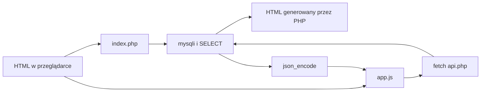

# Web Grounding — HTML, PHP i MySQL/MariaDB

## Cel

Samodzielny materiał dla uczniów INF.03: dwa krótkie wejścia do HTML oraz cztery rosnące przykłady PHP uruchamiane w XAMPP. PHP pozostaje małą warstwą łączącą stronę z MySQL/MariaDB; projekt nie uczy frameworka ani całego języka.

## Zakres

- `01-html-podstawy`: dokument HTML, semantyczne sekcje, tekst, lista i odnośnik.
- `02-html-formularz`: tabela, etykiety, formularz i podstawowy CSS.
- `03-php-podstawy`: PHP osadzone w HTML, zmienne, `if`, `foreach` i `echo`.
- `04-php-lista-z-bazy`: `mysqli_connect`, `SELECT`, iteracja i HTML generowany przez PHP.
- `05-php-formularz-i-select`: `POST`, walidacja, przygotowane zapytanie i wynik w tym samym pliku PHP.
- `06-php-json-do-javascriptu`: `api.php` zwracający JSON oraz `fetch()` renderujący dane w JavaScript.
- Jeden dump `database/web_grounding.sql` oraz instrukcja XAMPP.

## Granice

Bez Composera, npm, frameworków, ORM, logowania, sesji i pełnego CRUD-u. Przykłady używają proceduralnego `mysqli`, aby operator `->` nie był wymagany na wejściu. Wariant JSON jest oznaczony jako opcjonalny na egzaminie: gdy arkusz wymaga wyświetlenia danych przez skrypt PHP, uczeń ma użyć wariantu z `04` lub `05`.

## Przepływy

## Bezpieczeństwo i czytelność

- Dane HTML są kodowane przez `htmlspecialchars`.
- Formularz korzysta z przygotowanego zapytania, nie ze sklejania SQL.
- JavaScript używa `textContent`, nie `innerHTML` dla danych z bazy.
- Dane dostępowe `root` bez hasła są jawnie opisane jako lokalny wariant XAMPP/egzaminacyjny, nie produkcyjny.
- Każda strona ma `lang`, UTF-8, viewport, etykiety formularzy i czytelny stan błędu.

## Akceptacja

| AC | Wymaganie | Dowód |
| --- | --- | --- |
| AC-01 | Sześć przykładów rośnie od HTML do JSON bez zewnętrznych zależności. | Test kontraktu plików. |
| AC-02 | Trzy strony mieszają PHP z HTML i pokazują minimalną składnię. | Kontrola źródła; `php -l` gdy runtime jest dostępny. |
| AC-03 | Dwa przykłady pobierają dane przez `mysqli`, a formularz nie skleja wejścia z SQL. | Test kontraktu i lokalny XAMPP. |
| AC-04 | Endpoint JSON deklaruje UTF-8, zwraca JSON, a JS obsługuje sukces, pusty wynik i błąd. | Test kontraktu oraz przeglądarka z XAMPP. |
| AC-05 | Instrukcja prowadzi od importu SQL do właściwych adresów localhost. | Przegląd dokumentacji i ścieżek. |
| AC-06 | Materiał wyjaśnia ryzyko użycia JSON/JS w zadaniu wymagającym prezentacji przez PHP. | README i instrukcja ucznia. |

Brak lokalnego PHP/XAMPP oznacza `BLOCKED` dla dowodu runtime, nie zaliczony test.
